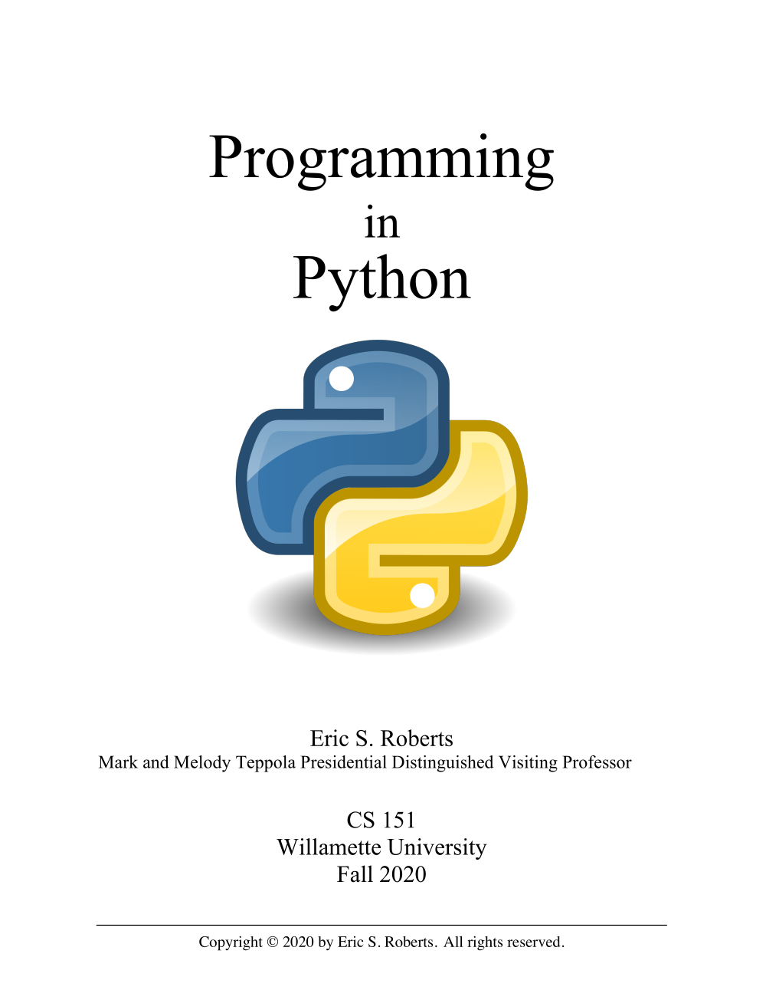

## Announcements
- Welcome to CS-500: MSCS Bridge!
- Things to do:
	- Access the course webpage [here!](https://jrembold.github.io/Website_Backup/classes/cs500/cs500/)
		- There will also be a link to the course webpage from the Canvas site once it forms
	- Read over the full syllabus
	- Get signed up with a GitHub account if you don't already have one (or if you want a separate one for school)
- Homework
	- Project 1 guide will be posted by the end of tomorrow

# Intro

## My Vitals
::::cols
:::col
Name
: Jed Rembold

Office
: Ford 214

Office Hours
: Online by appointment or anytime I'm around

Email:
: jjrembold at willamette.edu

Office Phone:
: 503-370-6860

:::
:::col
{width=70%}
:::
::::


## How to Succeed
- Folks are entering this course with a variety of initial experiences
	- I'm targeting a starting point just slightly past the "very beginning"
- Path to Success
	- There can be a significant time commitment for this course
		- The main way to get good at coding is to **do** coding
		- Coding can often times involve a lot of frustrating troubleshooting or failed attempts
		- Expect, on average, the full use of WU's 2-3 hours outside class for every hour in class
	- If you are stuck for more than 30 minutes, _ask myself or AI or another mentor for help_
		- While it is important to give yourself time to troubleshoot, past a certain point continuing to bang your head against a problem just leads to frustration


## Grading
::::cols
:::col
- All end of semester grades are credit/no-credit. 
- Credit is anything >70%
:::

:::col
------------- ----------
Participation        50%
Projects             50%
------------- ----------

:::
::::


## Participation
- Class will often times have "understanding check" polling questions
    - Just a web interface you can respond with
    - Answering at all gets you credit, correct answers will get you a bit of extra credit
- A large portion of class will be dedicated to pair-programming exercises each week
    - You get full credit for you and your partner completing all the exercises


## Projects
- Each week will have a different project for you to work on
- All will be due on Thursdays at 11:59pm
- Submissions will be handled through GitHub Classroom
	- Learning how to do this in class
- 2 cumulative late days over the entire semester without penalty then penalties enacted for each subsequent day late
- Extensions for any reason need to be requested and approved by myself


## Academic Honesty
1. You must not look at solutions or program code that is not your own.
2.  You must not share your solution code with other students.
    - But you are welcome (and encouraged!) to work alongside others en route to finding a solution.
3. You must indicate on your submitted assignment any assistance you received or who you worked alongside.


## AI
::::::cols
::::{.col style='font-size:.9em'}
- You are free in this class to use things like ChatGPT or GitHub Copilot to assist you in writing, understanding, or troubleshooting code
- **However:**
	- LLMs make mistakes, and you need to understand the code to be able to catch them. If you can't explain what every line of a piece of code is doing, that is a problem.
- I just ask that you make a note on the assignment if you got help from one of these sources, and link to the transcript if possible.
::::

::::col
{width=70%}

::::
::::::


## Diving In
:::cols
::::col
- This course is an introduction on _computer science_, and covers more than just programming!
- Python is used to teach the programming portion of the course, but the focus is less on Python itself and more on general computer science principles.
- If you come across situations where you need to know a bit more about specific Python details, there are plenty of resources online, or just ask me!
::::

::::col
<!--<p class="stretch"></p>-->
{width=70%}
::::
:::

## Effective Communication
::: incremental
- To communicate effectively with someone or something, you really need two layers of communication:
	- A shared language or method of conveying information 
		- The English alphabet, for example
		- In our case, Python
	- A joint agreement about what constitutes **meaning**
		- Need ways to limit confusion or misunderstanding
			- Following conventions
		- Being able to explain things clearly and unambiguously
:::


## Algorithms
- The process of designing a solution strategy to a problem is called _algorithmic design_
- An _algorithm_ is just an approach or recipe for a method to solve a particular problem
	- Most commonly language agnostic
- Algorithms are not a new concept
	- Euclid's algorithm to find the greatest common divisor, for instance
- A large part of computer science is focused on the study or analysis of algorithms

## Algorithm ⮕ Code
- You need to have an algorithm in place **before** you can write the code to tell the computer what you want to do
	- Imagine an alien asking me how to bake a cake. I need to understand the steps to baking the cake before I can even worry about the translation or communication
- Programming tools like conditional statements and loops will frequently play a role in your algorithm, but as general concepts
	- I can easily describe a loop to you without needing the exact syntax of Python
- The _implementation_ of the algorithm is the act of translating it into Python (or whatever language you are using)

# Numeric Types

## Data Types
- Generally, the data processed by computers can take on many forms
- A _data type_ defines the common characteristics of some data values that have a certain form or purpose.
	- Ex: a whole number or integer has certain characteristics common to all integers
- A data type has a _domain_, which is the set of all potential values that would belong to that type.
	- Ex: 0, 1, 2, 3, 4, 5, 6, 7, ...
- A data type has a _set of operations_ that define how those values can be manipulated
	- Ex: You can add two whole numbers (5 + 2)

## Numeric Types
- Initially, we'll focus on the numeric types
- Python has 3 data types for representing numbers:
	- `int`{.python} for integers and whole numbers

		```python
		1, 2, 3, 10, 1001010101, -231
		```

	- `float`{.python} for numbers containing a decimal point

		```python
		1.23, 3.14, 10.001, 0.0, -8.23
		```

	- `complex`{.python} for numbers with an imaginary component (which we won't deal with)

---

## Expressions
- Python describes computation using _arithmetic expressions_, which consist of _terms_ joined by _operators_
	- Very similar to how a logical English sentence has nouns connected by verbs
- A term in an expression can be:
	- an explicit numeric value (called a literal) like 1 or 3.14
	- a variable name serving as a placeholder to a value (more on those in a moment!)
	- a value resulting from the output of a function call (more on those on Monday!)
	- another expression enclosed in parentheses

<br>


## Integer and Float Operations
:::{style='font-size:.85em'}
- `i + j`  the _sum_ of `i` and `j`[]{.orange}
- `i - j`  the _difference_ between `i` and `j`[]{.orange}
- `i * j`  the _product_ of `i` and `j`[]{.orange}
- `i // j`  the _floor division_ of `i` by `j`[]{.orange}
- `i / j`  the _division_ of `i` by `j`[†]{.orange}
- `i % j`  the _remainder_ when `i` is divided by `j`[]{.orange}
- `i ** j`  `i` to the _power_ of `j`[]{.orange}[‡]{.orange}
- `-j`  the _negation_ of `j`[]{.orange}

:::
<hr>

:::{style='font-size:.9em'}
[]{.orange} -- Returns `int` if both `i` and `j` are integers, `float` otherwise

[†]{.orange} -- Returns `float` always

[‡]{.orange} -- Returns `float` always if `j` is negative
:::

## Order of Operations
- Basic order of operations applies just like in math!
- Operations in parentheses done first
- Without parentheses, order of operations proceeds as:
	- `**` (exponents, executed _right to left_)
	- `-n` (negative numbers)
	- `*`, `/`, `//`, `%`, executed from left to right
	- `+` and `-`, executed from left to right


## Understanding Check {data-notes="Solution: 15"}
What is the value of the below expression?

` 1 * 2 * 3 + (4 + 5) % 6 + (7 * 8) // 9 `{.python .inlinecode}

:::{.poll}
#. 15
#. 18.22
#. 42
#. 83
:::

## Boolean Expressions
- Python defines two types of operators that work with Boolean data: _relational operators_ and _logical operators_
- Relational operators compare values of other types and produce a boolean `True`/`False` result:

	---- ----------------- - - - ---- --------------------
	`==` Equals                  `!=` Not equals
	 `<` Less than               `<=` Less than or equal too
	 `>` Greater than            `>=` Greater than or equal to
	---- ----------------- - - - ---- --------------------
- Be careful! `==` _compares_ two values. A single `=` _assigns_ a variable. The odds are high you'll use one when you meant the other at least once this semester!


## The Vulcan Way
- Logical operators act on Boolean pairings

	Operator | Description
	---|---
	`A and B` | True if both terms True, False otherwise
	`A or B` | True if _any_ term is True, False otherwise
	`not A` | True if A False, False if A True (opposite)

::: incremental
- Order of operations follows parentheses and then proceeds left to right
- Careful that `or` is still `True` if both options are `True` 
- Similarly, careful with combining `not` with `and` and `or`
	- "Not A or B" in common English is not the same as `not A or B`
:::

# Variables

## Tis Variable 
:::{style='font-size:.9em'}
- One of the terms that can appear in expressions is what we term a variable
- A _variable_ is a placeholder or nametag for a value that can be updated as the program progresses
- Envision as a named box capable of storing a value
		\begin{tikzpicture}%%width=20%, alt='Will this work?, data-id=box'
			\useasboundingbox (-2,-1) rectangle (2,1.5);
			\node[draw, very thick, MGreen, minimum width=3cm, minimum height=1.5cm, font=\LARGE](box) {42};
			\node[MGreen, anchor=south west, inner sep=0pt, yshift=1mm] at (box.north west) {Name};
		\end{tikzpicture}
- Each variable has the following attributes:
	- A _name_: which enables you to tell variables apart
	- A _value_: which represents the current contents of the variable
- A variable's name is fixed, but the value can change whenever you _assign_ a new value to the variable
:::

## Making Assignments
- You create a variable by assigning it a value with Python's _assignment statement_, `=`, a single equals sign:

	```python
	|||variable name||| = |||expression|||
	```
- The `|||variable name|||` **must** appear on the left of the `=` in Python!
- Python first computes the value of the right-hand side of the equals and then assigns to the name on the left
	- The same variable name can seem to appear on both sides of the equals!
		
		```python
		total = total + value
		```

	  - The `total` on the right represents some existing value
	  - The `total` on the left is the new label of whatever the right expression evaluates to

## Ephemeral Variables
::::::cols
::::col
- When you assign a new value to a variable, the old value is lost
 
	```{.idle .python-repl style='font-size:0.8em'}
	>>> A = 10
	>>> A
	10
	>>> B = A + 5
	>>> B
	15
	>>> A = B
	>>> A
	15
	```

::::

::::col
- Variables defined in terms of others do **not** get automatically updated
- Python evaluates expressions from the top down

	```{.idle .python-repl style="font-size:0.8em"}
	>>> A = 10
	>>> B = A + 2
	>>> A = 8
	>>> B
	12
	```

::::
::::::


## The Power of Names 
:::{style='font-size:.9em'}
- Names for variables, functions, and (eventually) classes are called _identifiers_
- Composed of letters, numbers and underscores, but **can not start with a number**
- A variety of different conventions to mark word boundaries:
	- _Snake case_ uses underscores: `this_is_amazing`
	- _Camel case_ uses uppercase: `thisIsAmazing`
- We will aim to follow the following conventions:
	- Variable and function names will use snake case
	- Constant variables will use all uppercase and underscores: `MAX_WIDTH`
	- Class names will use camel case and begin with a capital letter
- Capitalization matters! `radius` and `Radius` are different variable names!
- **Pick meaningful variable names!**
:::

## Shorthand and Multiple Assignments
:::{style='font-size:.9em'}
- It is very common to want to adjust an existing variable value
  ```python
  balance = balance + deposit
  ```
- Python gives you a shorter expression to describe this relationship:
  ```python
  balance += deposit
  ```
- You can do this with any operation (`|||op|||`) following the general form:
  ```python
  |||variable||| |||op|||= |||expression|||
  ```
- You can name multiple variables at once by separating with commas
  ```python
  A, B, C = 1, 2, 3
  ``` 
	- All the expressions on the right are computed before being assigned to the left variables
	- This can give you a very concise way of swapping variable values

:::

## Understanding Check! {data-notes="Solution: 40"}
What is the output value of `A` in the code below?
```{.idle .python-repl}
>>> A = 10
>>> B = 4
>>> C = A * B
>>> A -= B
>>> A, B, C = C, A, B
>>> A
??
```
:::{.hpoll}
#. 4
#. 10
#. 30
#. 40
:::


## Understanding Check
What value is printed when the code to the right runs?

:::: cols
::: col
:::::{.poll}
#. `True`
#. `False`
#. 5
#. This would give an error
:::::
:::

::: {.col style="flex-grow:2;"}
```python
A = 10
B = 4
C = 1
A *= B
if A > 40 and C != 10 % 4:
	print(B+C)
else:
	print(A < B or not (C == 10 // 4))

```
:::
::::

# Strings


## A String primer
- A _string_ in Python in a data type that represents textual data, in the form of a sequence of individual characters
	- Domain: all possible sequences of characters
	- Operations: **Many!** But we'll keep in quite simple initially
- Denoted by placing the desired sequence of characters between two quotation marks
	- `'I am a string'`
	- In Python, either single or double quotes can be used, but the ends must match
		- `"I am also a string!"`
		- `"I'm sad you've gone"`


## Lengths
- The number of characters in a string is commonly called its _length_
- The length of a string can be found using the built-in function `len()`
  ```python
  >>> len("Totally awesome")
  15
  ```
- In practice, this function works for any sequence, of which strings are just our first example


## Character Picking
- A string is an _ordered_ sequence of characters
	- Character positions in the string are identified by an _index_, which **starts at 0**

\begin{tikzpicture}%%width=70%
[
block/.style={draw, thick, MGreen, font=\tt\LARGE, minimum size=1cm}
]
\foreach[count=\i from 0] \x in {s,p,a,g,h,e,t,t,i, ,s,a,u,c,e}{
	\node[block, baseline=0](char) at (\i, 0) {$\strut$\x};
	\node[below=0cm of char, MBlue,anchor=north, font=\large] {\i};
}
\end{tikzpicture}

- You can select individual characters from the string using the syntax

	```python
	|||string|||[|||k|||]
	```

	where `|||string|||` is the variable assigned to the desired string and `|||k|||` is the index integer of the character you want
```{.python-repl style='font-size:.7em'}
>>> print("spaghetti sauce"[5])
e
```

## Back it Up
- Sometimes it is more useful to count from the end of the string, not the beginning
- Python gives you a convenient way to do this, using negative indexes

<br>

\begin{tikzpicture}%%width=70%
[
block/.style={draw, thick, MGreen, font=\tt\LARGE, minimum size=1cm}
]
\foreach[count=\x from 0, evaluate=\x as \i using {int(15-\x)}] \s in {s,p,a,g,h,e,t,t,i, ,s,a,u,c,e}{
	\node[block,baseline=0](char) at (\x, 0) {$\strut$\s};
	\node[below=0cm of char, MBlue,anchor=north, font=\large] {-\i};
}
\end{tikzpicture}

- A common use case is to grab the last character of the string, using

	```python
	s[-1]
	```
	which is shorthand for

	```python
	s[len(s)-1]
	```

## Slicing
- Often, you may want more than a single character
- Python allows you to specify a starting and an ending index through an operation known as _slicing_
- The syntax looks like:

	```python
	|||string_variable|||[|||start||| : |||limit|||]
	```
  where `|||start|||` is the first index to be included and everything up to but **not including** the `|||limit|||` is included
- `|||start|||` and `|||limit|||` are actually optional (but the `:` is not)
	- If `|||start|||` omitted, the slice will begin at the start of the string
	- If `|||limit|||` omitted, the slice will proceed to the end of the string


## and Dicing
- Can add a third component to the slice syntax, called a _stride_
  ```python
  |||string_variable|||[|||start||| : |||limit||| : |||stride|||]
  ```
- Specifies how large the steps are between each included index
- Can also make the stride negative to proceed backwards through a string
  ```python-repl
  >>> s = "spaghetti sauce"
  >>> s[4:8]
  hett
  >>> s[10:]
  sauce
  >>> s[:10:2]
  sahti
  ```

## Concatenation
:::{style='font-size:.9em'}
- _Concatenation_ is the act of taking two separate objects and bringing them together to create a single new object
- For sequences, of which strings are a type, concatenation takes the contents of one sequence and add them to the end of another sequence
- Python _overloads_ the `+` operator to concatenate sequences like strings
	- This is why keeping track of variable types is important! `+` will **add** two numbers, but will **concatenate** two strings!

  ```python
  >>> 'fish' + 'sticks'
  'fishsticks'
  ```
- Unlike in addition, order matters here!
  ```python
  >>> 'sticks' + 'fish'
  'sticksfish'
  ```
:::

## Repeat again?
- We've seen how we can use addition (`+`) in Python to concatenate strings
- In math, adding something many times is the same as multiplying

$$5+5+5+5+5+5 = 6 \times 5$$

- The same logic holds true for Python strings!
	- You multiply by a **integer**: the number of times you want the concatenation repeated
	- You can not multiply two strings together, Python will not understand what you are trying to do
```python
print("Betelguese, " * 3)
```

## Comparing Strings
- Python lets you use normal comparison operators to compare  strings

	```python
	string1 == string2
	```
	is true if `string1` and `string2` contain the same characters in the same order
- Comparisons involving greater than or less than are done similar to alphabetical ordering
	- Start at the beginning and compare a character. If they are the same, then compare the next character, etc
- All comparisons are done **according to their Unicode values**.
	- Called _lexicographic ordering_
	- `"cat" > "CAT"`


## String Looping
- Because strings are a sequence, they will work directly in a `for` loop!
- In general, you have two options of how you want to loop through a string:

::::::cols
::::col

:::{.block name="By Index"}
```python
s = "hello"
for i in range(len(s)):
	print(s[i], 'is letter', i)
```
:::

::::

::::col
:::{.block name="By Letter"}
```python
s = "hello"
for letter in s:
	print(letter)
```
:::

::::
::::::

- Looping by letter can be very convenient, but you lose positional information
- You can always select the desired letter if looping by index


## Can't change a string's colors
- Strings are what we call _immutable_: they can not be modified in place by clients.
- You can "look" at different parts of the string, but you can not "change" those parts without making a whole new string
  ```{.python .badcode}
  s = "Cats!"
  s[0] = "R"   # THIS WILL ERROR!!
  ```
- You can of course create a new string object with the desired traits:
  ```python
  s = "R" + s[1:]
  ```
- This applies to all methods that act on strings as well: they return a **new** string, they do not modify the original


# Basic IO

## Output: `print`
:::{style='font-size:.89em'}
- We've seen how to output the value of a variable from within Python's REPL, but that won't work in a script
- Python's built-in `print()` function will display whatever is between the `()` to the terminal

  ```python-repl
  >>> A = 10
  >>> print(A)
  10
  ```

- If you want to display several things, separate each thing by a comma inside the `print` statement. This will insert a space between each when printed.
	
  ```python-repl
  >>> print(1,3,5)
  1 3 5
  ```
:::

## F not G
- Constructing text or a sentence by interleaving strings and other objects comes up a lot in communicating code results to a user
- For any Python version past 3.6, the nicest and easiest way to do this is with what are called _f-strings_:
  ```python
  A = 10
  print(f"The value of A is: {A}!")
  ```
- You can define an f-string anytime you would normally define a string, just be aware that the substitution happens with the values of variable _at that point_
  ```python 
  A = 10
  s = f"The value of A is {A}"
  A = 12
  print(s)
  ```

## Getting some `input`
- We've seen how to display information to a user, but to retrieve data from a user, we can use Python's built-in `input()` function
- The form will generally look like:

  ```python
  |||variable||| = input(|||prompt_text|||)
  ```
    - `|||variable|||` is the variable name you want to assign the user's typed input to
	- `|||prompt_text|||` is the string that will be displayed on the screen to communicate to the user what they should be doing
- The `input()` function **always returns a string**
	- If you want to get an integer from the user, you will need to convert it yourself after retrieving it
	
	  ```python
	  num = int(input('Pick a number between 1 and 10: '))
	  ```

# Demo: Hailstone Problem

## Hailstones
::::::cols
::::col
- In Douglas Hofstadter's book _Gödel, Escheer, Bach_, he includes the following puzzle:
	- Pick some positive integer and call it `n`
	- If `n` is even, divide it by two.
	- If `n` is odd, multiply it by three and add one.
	- Continue this process until `n` is equal to 1.
::::

::::col
](https://imgs.xkcd.com/comics/collatz_conjecture.png){width=60%}

::::
::::::

## Our Problem
- Suppose we want to prompt the user to enter a starting value for `n` to kick off the sequence
- Then we'll run through the sequence, printing it off as we go.
- At the end, we'll summarize how many total steps it took us to reach 1.

# Break Time!

# Pair Programming

## Pair Programming Description
:::{style='font-size:.8em'}
- Every week we will have time set aside for pair programming
- How it works:
	- 1 _driver_: the person allowed to type
	- 1-2 _navigator(s)_: observers reviewing what is typed and brainstorming. **Not allowed to type**
	- Roles will rotate every 5-6 minutes (there will be an alert)
	- Talking is key! Communicate about what the problem is asking, how you might think about approaching the problem, and how you can translate that approach into Python.
- How does it work _remotely_?
	- Easiest approach is the **Live Share** extension through VSCode
	- 1 person accepts the assignment link, downloads and opens the repository in VSCode
	- Then they can click on "Share (Read/Write)" and paste the invite URL into their group's chat
	- Other's can then join, edit the code in a collaborative way, and view the console
	- When done, have the same person save the code written and upload it back to the repository.
:::

## This Weeks Pairs and Problems
- For this first week, the pairings will be:
	- Room 1: Hailee and Lucie
	- Room 2: Jace, Bryant, and Gokce
- The repository with the problems for this week can be accepted [here](https://classroom.github.com/a/peDxa61R).
	- First person to accept will need to name the group (just use first names)
	- Any others who accept will join that group and then have access to the same shared repository.
