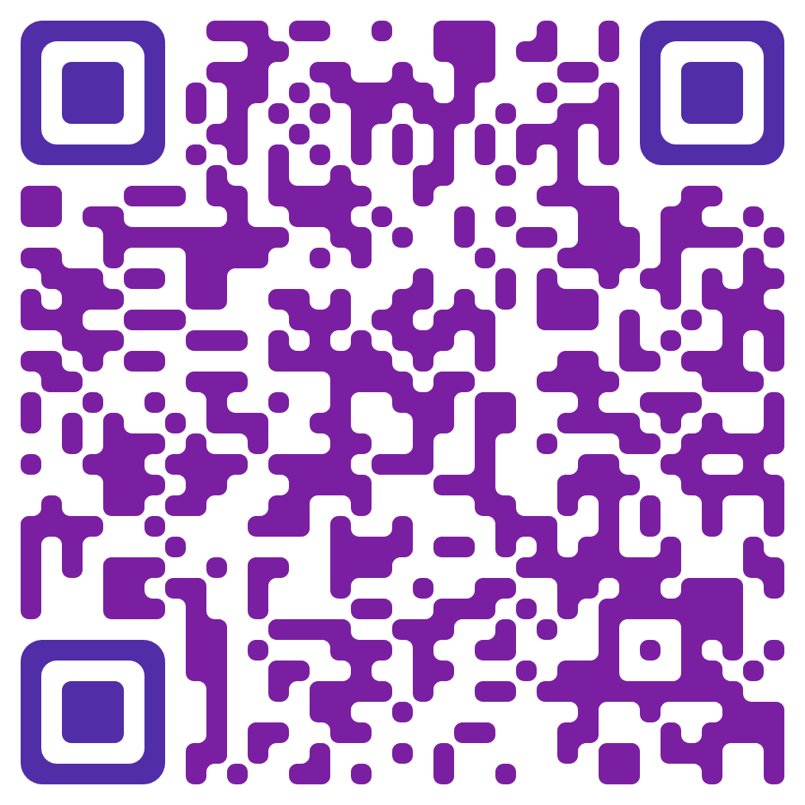

## Announcements
- Some structural parts of the course are still coming together, and should be up by the end of the week
    - Website
    - Canvas page
- From you:
    - Review the syllabus (especially dates of deadlines)
    - Fill out the interest form that will be sent out after tonight by Friday
    - Be looking for inspiration!

## Esoteric About Me
::::::cols
::::col
:::incremental
- You all already know me, so here are a few more random bits of Jed trivia:
    - I wanted to be an astronaut when I was little
    - I use the Dvorak keyboard layout instead of Qwerty
    - Ice cream is the best food
    - I have one cat whose name is Mittens
:::

::::

::::col

::::
::::::

## So what is a Capstone?
- A culmination project meant to demonstrate and showcase your mastery in the core areas of data science:
    - Statistics
    - Data visualization and presentation
    - Data engineering
    - Machine Learning
- A capstone project should embody _all_ of those aspects and synthesize them into a cohesive and compelling narrative
- Projects will be done in small groups of 2-3, assigned by myself

## But wait, there's more!
- Gotta get a job (or keep your options open)
- There is a lot that entails:
    - Understanding what you want to do
    - Networking
    - Marketing yourself
    - Interviewing
    - Professional conduct
- While not technical skills, these skills can be just important for actually landing a position as technical skills

## The Capstone Class
- This class will fundamentally stand on two legs:
    - Professional development
    - Creation and presentation of a capstone project
- Bonus: Being aware and able to discuss the current trends and news in the data science industry

## Objectives
Upon conclusion, you should be able to:

* Navigate the job market and leverage your skills and talents in job searches and job interviews
* Advertise yourself to potential employers, showcasing your past work
* Plan out and execute a large, extended research project, meeting deadlines along the way
* Present research findings to technical and non-technical individuals in a interactive, verbal setting
* Write up and communicate research findings in a clear and concise manner suitable for publication

## Deliverables

| Name                                | Weight |
|-------------------------------------|--------|
| Professional Development Activities | 20%    |
| GitHub Pages Portfolio              | 5%     |
| Project Proposal                    | 10%    |
| Data Summary                        | 10%    |
| Rough Draft Write-up                | 10%    |
| Final Presentation                  | 20%    |
| Final Draft Write-up                | 20%    |
| Weekly Check-ins                    | 5%     |

## Professional Development
- Approximately every other week Ruthie will be visiting and running the first half of class to focus on various professional development skills
    - The goal is to have you as prepared as possible as your apply for jobs
- Several rounds of mock interviews over the course of the semester
- Not currently looking for a new job? **This still applies**
    - The tech job market is a rapidly evolving beast, and the vast majority of tech-workers switch job multiple times over their career. Even if not immediately applicable to you, it almost assuredly will be at some point.
- Credit/no credit given for accomplishing the in-class activities.
    - Miss a week? You are responsible for getting the content and completing the activities, and showing them to me.
- Ruthie will start visiting us next week

## GitHub Pages Portfolio
- You need a publically visible location to market yourself and showcase your talents and past work
- Should be polished and informative
- Many ways this could be done, but hosting a site on GitHub Pages is probably the most straightforward method to get up and running
    - Many templates available so that you don't need a ton of front-end knowledge to make something nice
- Blogs are a method of raising your personal brand, and such pages can also serve as a platform for that sort of writing if you are interested.

## Project Milestones
- The capstone project is a large project that extends over multiple months, which is outside the typical student scheduling and organizing sweet spot.
- As such we have provided about one goal a month to ensure that you are staying on track and to help with your planning and scheduling
    - End of May: Project Proposal
    - End of June: Data Summary
    - End of July: Rough draft of write-up

## Milestones: Project Proposal
- A short write-up that details all of the planned ideas and steps that will bring the project to fruition
    - What is your central research question?
    - Where are you going to get your data from, and have you confirmed that is possible?
    - What statistics would you be looking at to help answer and provide confidence in your research question?
    - How will you be incorporating some aspect of machine learning into the project?
    - What general visuals would you imagine using to demonstrate your findings?
- While a proposal does not lock you in stone, it is an efficient roadmap. Deviating from it should only be done when unexpected things happen, as doing so is generally going to add time or other complications. The better you design the proposal, the more likely things will go smoothly.

## Milestones: Data Summary
- June is to be data aquisition month, and upon the end of June you are expected to have your data largely in hand
- If collecting live data, you should have your pipelines up and running and transforming data automatically into something immediately useful
- If collecting static data, you should have it all gathered and modeled/organized into tables for easy access
- Your data should be replicated on at _least_ two devices
- Past this point, you should not need to be devoting time and effort to your data collection.

## Aside: Data Sources
- Analyzing the same data as everyone else for new insights is very difficult
- Far better to leverage a data collection that is unique and curated by you
- The data that you collect and use for your capstone project should be data that is unique to your project.
    - That might mean that you scrape or pull together data that hasn't been compiled before
    - That might mean that you pull from many large datasets to construct an amalgamated dataset that has not been compiled before.
- Want a project that makes you marketable? Stay away from Kaggle or similar sites for primary data sources.

## Milestones: Rough Draft of Write-up
- The project write-up will be a web publication detailing your research question, your data, your methodology, and your conclusions.
- This rough draft should already include sections on all the projects main requirements.
- Going from the rough draft to the final draft should be about fine-tuning and clarifying, _not_ adding significant content.

## Final Presentation!
- The combined cohorts will present their projects on the last day of class, here in Portland
- You will have 15 minutes (12 + 3 for questions) to convey your project to an audience of your peers, faculty, and industry professionals.
- 12 minutes is **not** enough time to go into all the details of a 3-month project, so you need to prioritize and constrain yourself to telling the best story.
- Should be professional in appearance, delivery, and presentation.
- You **must** be present on this day. Put it on your calendar now.

## Final Draft
- Builds on the rough draft
- Extensively proofread and polished
    - Text and visuals should be as good as you can make them
- Published online and linked or otherwise connected to student's portfolios

## Check-ins
- Even monthly milestones can be a long time to plan
- It helps to remain cognizant and introspective of what you should be doing so that things do not fall by the wayside
- Every weekend, there will be a check-in form available
    - Should take less than 5 mins to complete
    - Asks questions like:
        - What was accomplished the previous week?
        - Rate how productive your group was over the previous week.
        - What are the plans for the upcoming week?
        - Where are you currently at in meeting the monthly milestone?
- Scored credit/no-credit and ONLY available Sat-Mon, so remember to fill them out!

## Late Policy
- The milestones are not recommendations, they are deadlines
- For each milestone you have a 24hr grace period that you can submit it without penalty.
- Past that it is 20% off each day.
- The final presentation and check-ins are exempt from this policy and must be completed on time for credit.

## Questions?!
- I've been thinking about this a ton and have tried to get it all down here, but there are probably some things I have forgotten. What questions can I answer?

## Research Questions vs EDA
- Exploratory Data Analysis != Research Question
- EDA might inform how you approach a research question, but **it is not the question (or the answer)**
- A research question needs to:
    - Be clear and focused
    - Address a particular problem
    - Be empirically answerable with credible sources
    - Be complex enough to merit a detailed answer (just yes/no probably isn't enough)

## Good vs Bad Research Questions

::::::cols
::::col
:::{.block name='Good Research Questions'}
- Have no simple answer -- are open-ended and consider cause/effect
- Are "researchable" -- can be answered with accessible research, facts and data
- Often begin with: how, why, what, and which
- Are interesting to others
- An answer can be hypothesized and tested
- Focuses on a single topic and question
- Are as specific as possible about what they are asking, using well-defined concepts
:::
::::

::::col
:::{.block name='Bad Research Questions' .bad}
- Have simple or easy answers -- can be answered with one word, a number, or a list
- Can not be answered because the facts and data don't exist, or only answered with an opinion
- Often begin with: who, when, where, how much, or how many
- Nobody cares about the answer
- No specific hypothesis can be formed that addresses the question
:::

::::
::::::

## Good and Bad Questions
- Poll [link](https://www.polleverywhere.com/multiple_choice_polls/khA6wDi8ilekGQ9bjbIAF?preview=true&controls=none)

## Break Time!

## Brainstorm Speed Dating!
:::{style='font-size:.9em'}
- The key to starting any good project is to think of a topic you'd be interested in answering a question in
- There are a **huge** number of possible topics with data science implications
- Using the back row of tables, I need 3 people sitting on each side facing one another (6 on each)
- If you are facing the front of the room, you will move each round
- If you are facing the back, you will be handed a stack of 12 cards. **Do not reorder them.**
- Each round, flip over the top card. Then you have 6 minutes to brainstorm with your partner as many ideas as possible around that theme
- After 6 minutes are up, I'll give you one minute to write down any last thoughts you have and then movers will move one position to their left (wrapping around)
:::

## Group Synthesis
::::::cols
::::col
- For the next 20 or so minutes, I'd like you to try to choose your 1-3 ideas from each theme and add them to the [linked](https://jamboard.google.com/d/1A3ws__5NOuuYfgWUtvtgd9lkejBtlOvYnK0Oy49YbkM/edit?usp=sharing) Jamboard as sticky notes
- The purpose is to try to disperse the great ideas you had in your pairings to the group as a whole
- Don't worry yet about distilling down to a research question, just the ideas you had
::::

::::col

::::
::::::

## Thats it folks!
- Look for an email from me with a poll to help me determine pairs/groups, and fill out by Friday
- No check-in this first week
- Look around for further inspiration at different topics and ideas for what you might want to investigate!
